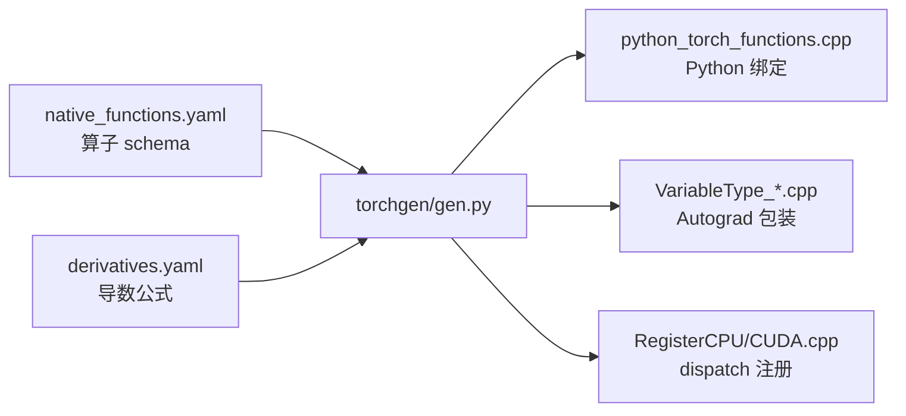

> **本文回答一个问题**：当你写下 `y = x * 2; y.sum().backward()` 这行看似平凡的代码时，PyTorch 内部到底发生了什么？——从 Python 绑定层的参数解析，到 Dispatcher 的算子路由，到 CUDA 内存池的 Block 分配，再到 Autograd 引擎多线程执行反向图，最后延伸到 torch.compile 如何把这一切整个"编译掉"。

作为 LLM Infra 工程师，你大概率每天都在和 PyTorch 打交道：排查一个诡异的 `CUDA out of memory. Tried to allocate ...`（明明 `nvidia-smi` 显示还有空余），定位一次 DDP 训练中的通信 hang，或者琢磨为什么 `torch.compile` 之后模型反而变慢了。这些问题的答案都不在 API 文档里，而在源码里。

本文以 PyTorch main branch（2024-2026）为参考版本，自底向上拆解 PyTorch 的核心子系统。全文结构鸟瞰如下：

```text
                        ┌─────────────────────────────────────────┐
                        │   一、为什么要读源码   二、仓库全景地图      │
                        │              （导览层）                   │
                        └───────────────────┬─────────────────────┘
                                            ▼
        ┌───────────────────────────────────────────────────────────┐
        │                     Eager 执行栈（自底向上）                  │
        │                                                           │
        │   三、Tensor 内部     TensorImpl / Storage / stride        │
        │   四、Dispatcher     DispatchKey / native_functions.yaml  │
        │   五、Autograd       Node / Edge / ReadyQueue              │
        │   六、Python 绑定    THPVariable / GIL                     │
        │   七、nn.Module      __setattr__ / state_dict / hooks     │
        │   八、CUDA 内存      CUDACachingAllocator / stream 语义     │
        └───────────────────────────┬───────────────────────────────┘
                                    ▼
        ┌───────────────────────────────────────────────────────────┐
        │                    2.x 编译与分布式栈                        │
        │                                                           │
        │   九、torch.compile  Dynamo / AOTAutograd / Inductor       │
        │   十、分布式          c10d / DDP bucket / FSDP             │
        │   十一、演进脉络      从 Eager 到 Compile 的取舍             │
        └───────────────────────────────────────────────────────────┘
```

---

## 一、为什么要读 PyTorch 源码

### 1.1 API 文档回答不了的问题

PyTorch 的文档很完善，但它回答的是"怎么用"。下面这类问题，文档不会告诉你答案：

- 为什么 `reserved memory` 远大于 `allocated memory`？——答案在 `c10/cuda/CUDACachingAllocator.cpp` 的 Block/Segment 池化设计里。
- 为什么 `tensor.transpose(0, 1)` 之后 `view()` 会报错，而 `reshape()` 不会？——答案在 TensorImpl 的 stride 机制里。
- 为什么自定义算子注册到 `CUDA` key 之后 autograd 就"自动"能用了（或者不能用）？——答案在 Dispatcher 的 key 分层结构里。
- 为什么 DDP 的梯度通信能和反向计算重叠？——答案在 `reducer.cpp` 的 bucket 设计与 autograd hook 里。
- 为什么 `torch.compile` 有时越编译越慢？——答案在 guard 失效引发的 recompile 与 graph break 里。

对 LLM Infra 工程师而言，训练框架（Megatron/verl/DeepSpeed）和推理框架（vLLM/SGLang）都构建在 PyTorch 之上。理解 PyTorch 的内部机制，是排查这些上层框架疑难问题的地基。

### 1.2 一个坐标系：从一行代码看全栈

以最简单的 `torch.add(x, y)` 为例，一次调用穿越的层次：

```text
Python:  torch.add(x, y)
   │
   ▼  torch/csrc/  代码生成的绑定 (python_torch_functions.cpp)
C++:   解析 PyObject* 参数 → at::Tensor
   │
   ▼  aten/src/ATen/core/dispatch/Dispatcher.h
Dispatch:  收集 DispatchKeySet → 取最高优先级 key
   │
   ├──▶ AutogradCUDA handler：记录 grad_fn，向下再 dispatch
   │
   ▼  aten/src/ATen/native/
Kernel:  CUDA kernel launch（经 CUDACachingAllocator 分配输出）
   │
   ▼
返回:  THPVariable_Wrap → Python 拿到新的 torch.Tensor
```

本文后面的每一章，都是在放大这张图的某一层。

### 1.3 阅读版图：仓库规模

PyTorch 主仓库有数百万行代码，但核心骨架高度收敛。真正需要精读的文件不超过 20 个，本文会逐一给出路径——比如 `c10/core/TensorImpl.h`、`torch/csrc/autograd/engine.cpp`、`aten/src/ATen/native/native_functions.yaml`。读源码的正确姿势不是从 `git clone` 后逐目录遍历，而是带着问题、沿着调用链纵向切入。

---

## 二、仓库全景地图

### 2.1 顶层目录职责

| 目录 | 名字由来 | 职责 |
|---|---|---|
| `c10/` | Caffe2 + A"Ten" = C10 | **核心抽象层**：TensorImpl/StorageImpl 数据结构、Allocator 接口、DispatchKey 枚举、Device/Stream 抽象、`intrusive_ptr` 引用计数 |
| `aten/` | "A Tensor Library" | **算子实现层**：所有 Tensor 操作的 C++ 内核，主体在 `aten/src/ATen/native/` |
| `torch/` | Python 包 | **Python 前端**：`torch.nn`、`torch.optim`、`torch.distributed`、`torch.fx`、`torch._dynamo`、`torch._inductor` |
| `torch/csrc/` | C source for torch | **C++/Python 桥接层**：THPVariable 绑定、Autograd 引擎、JIT、分布式 autograd |
| `torchgen/` | Torch Code Generator | **代码生成器**：解析 `native_functions.yaml`，生成 dispatch 注册代码与 Python 绑定 |
| `functorch/` | Function transforms | JAX 风格函数变换（vmap/grad），已部分并入 `torch/_functorch/` |

### 2.2 依赖关系：严格自底向上

```text
┌─────────────────────────────────────────────────┐
│  torch/          Python 层（nn / optim / fx …）   │
├─────────────────────────────────────────────────┤
│  torch/csrc/     Python 绑定 + Autograd 引擎      │
├─────────────────────────────────────────────────┤
│  aten/           算子内核（CPU / CUDA native）     │
├─────────────────────────────────────────────────┤
│  c10/            核心抽象（零外部依赖的纯 C++）      │
└─────────────────────────────────────────────────┘
          ▲
          │ 构建时注入生成代码
┌─────────┴────────┐
│  torchgen/       │  读 native_functions.yaml
│  （代码生成器）    │  生成绑定 + dispatch 注册
└──────────────────┘
```

这个分层不是形式主义：`c10/` 被刻意设计成零依赖，使得移动端、边缘设备可以只链接 `c10` + 少量算子，而不必背上整个 ATen；`torchgen` 则把约 2000 个算子的重复胶水代码从人手里解放出来（第四章详述）。

### 2.3 一条构建期的暗线：代码生成

PyTorch 编译时有一个容易被忽略的步骤：`torchgen/gen.py` 读取 `aten/src/ATen/native/native_functions.yaml`，生成一大批 `.cpp` 文件（Python 绑定 `python_torch_functions.cpp`、autograd 包装 `VariableType_*.cpp`、dispatch 注册代码等），注入 build 目录参与编译。**这些生成文件不入 git**——所以当你在 GitHub 上搜索某个函数的定义却搜不到时，多半是撞上了生成代码。



---

## 三、Tensor 的真面目：TensorImpl 与 Storage

### 3.1 三层结构：句柄、元数据、数据

Python 里的 `torch.Tensor` 在 C++ 侧只是一个轻量句柄——`c10::intrusive_ptr<TensorImpl>` 的 typedef。真正持有内存的是 Storage：

```text
   Python 侧              C++ 侧（c10/core/）
┌────────────┐    ┌──────────────────────────────┐
│torch.Tensor │───▶│ TensorImpl                   │
│（THPVariable）│    │  sizes_    = [2, 3]          │
└────────────┘    │  strides_  = [3, 1]          │
                  │  storage_offset_ = 0         │
                  │  dtype / device / layout     │
                  │  autograd_meta_ (grad_fn 等) │
                  │  storage_ ──────────────┐    │
                  └─────────────────────────│────┘
                                            ▼
                  ┌──────────────────────────────┐
                  │ StorageImpl                  │
                  │  data_ptr_ ──▶ raw memory    │
                  │  nbytes_                     │
                  │  allocator_                  │
                  └──────────────────────────────┘
```

- **TensorImpl**（`c10/core/TensorImpl.h`）：持有 metadata——`sizes_`、`strides_`、`storage_offset_`、dtype、device、layout，以及指向 StorageImpl 的 `intrusive_ptr`。
- **StorageImpl**（`c10/core/StorageImpl.h`）：持有 `DataPtr`（实际内存指针）+ allocator + 字节数。**它对 shape 一无所知**，只是一段带类型擦除的连续字节。

**为什么要这样分离？** 因为它让"多个逻辑视图共享同一份物理数据"成为一等公民：view 语义、`torch.chunk`、切片、`share_memory_()` 乃至 FSDP 的 flat parameter，全都建立在"N 个 TensorImpl → 1 个 StorageImpl"这一关系上。

### 3.2 Stride：从逻辑坐标到物理地址

给定索引 $(i_{0}, i_{1}, \dots, i_{n-1})$，元素的物理位置由下式给出：

$$
\text{addr} = \text{storage\_offset} + \sum_{k} i_{k} \times \text{stride}_{k}
$$

一个 `[2, 3]` 的连续 tensor，strides 为 `[3, 1]`；对它做 `transpose(0, 1)` 后，shape 变为 `[3, 2]`，strides 变为 `[1, 3]`——**没有一个字节被移动**，只是换了一套"读数规则"：

```python
x = torch.arange(6).reshape(2, 3)   # sizes=[2,3], strides=[3,1], 连续
y = x.transpose(0, 1)               # sizes=[3,2], strides=[1,3], 非连续
y.data_ptr() == x.data_ptr()        # True，共享同一个 Storage
y.view(-1)                          # RuntimeError：非连续布局无法 view
y.reshape(-1)                       # OK：reshape 发现无法零拷贝，隐式 copy
```

这也解释了 `view` 与 `reshape` 的语义差异：`view` 承诺零拷贝，做不到就报错；`reshape` 尽力零拷贝，做不到就退化成 copy。对性能敏感的代码，这个差异意味着一次隐藏的 D2D 拷贝。

### 3.3 dtype × device × layout：Tensor 类型的三维扩展点

Tensor 的"类型"由三个正交维度决定：

- **device**：CPU / CUDA / XLA / MPS ……每种 device 有独立的 Allocator；
- **layout**：Strided（默认）/ Sparse / MKL-DNN blocked；
- **dtype**：float32 / float16 / bfloat16 / int8 / quantized ……

三者的笛卡尔积定义了所有可能的 Tensor 类型（封装在 `c10/core/TensorOptions.h`），也决定了 Dispatcher 最终路由到哪个 kernel。早期 Torch 用类名的组合爆炸表达这个积（`FloatCUDATensor` 之类），现代 PyTorch 用运行时 metadata + dispatch 解决——这是第四章的主题。

### 3.4 intrusive_ptr：为什么不用 shared_ptr

Tensor 的引用计数用的是自研的 `c10::intrusive_ptr`（`c10/util/intrusive_ptr.h`），refcount（`refcount_` + `weakcount_`）直接嵌在 TensorImpl 对象里。相比 `std::shared_ptr`：

1. **省一次堆分配**：`shared_ptr` 需要单独的控制块，`make_shared` 虽可合并，但从裸指针构造时必然多一次分配；
2. **对象自持计数**：可以安全地从 `this` 构造新的 `intrusive_ptr`，方便 C++/Python 边界来回传递所有权（THPVariable 与 at::Tensor 之间反复转手就依赖这一点）。

在"每秒创建销毁百万级 Tensor 句柄"的 eager 模式下，这类微观优化累积起来非常可观。

---

## 四、Dispatcher：PyTorch 的算子路由器

### 4.1 问题：一个 add，几十种命运

同一个 `torch.add`，可能落到 CPU kernel、CUDA kernel、稀疏 kernel、量化 kernel；调用前可能要先经过 autograd 记录、tracing 记录、functionalization 改写、AMP 自动 cast……如果用 `if/else` 或者 C++ 虚函数来组织，这些"横切关注点"会把代码搅成一团。PyTorch 的答案是 **Dispatcher**（`aten/src/ATen/core/dispatch/Dispatcher.h`）：为每个算子维护一张按 DispatchKey 索引的函数指针表。

```text
                     DispatchKey（按优先级从高到低 →）
             ┌───────────┬──────────┬─────────┬─────────┬─────────┐
   operator  │ Autocast  │ Autograd │ Tracing │  CUDA   │   CPU   │
 ┌───────────┼───────────┼──────────┼─────────┼─────────┼─────────┤
 │ aten::add │  fallthr. │ Variable │  trace  │ add_cu  │ add_cpu │
 │ aten::mul │  fallthr. │ Variable │  trace  │ mul_cu  │ mul_cpu │
 │ aten::mm  │ cast_fp16 │ Variable │  trace  │ mm_cu   │ mm_cpu  │
 └───────────┴───────────┴──────────┴─────────┴─────────┴─────────┘
        每个格子 = 一个 kernel 函数指针（或 fallthrough / fallback）
```

### 4.2 DispatchKey 与 DispatchKeySet 的计算

- **DispatchKey**（`c10/core/DispatchKey.h`）：一个枚举值代表一个横切关注点——CPU、CUDA、AutogradCPU、AutogradCUDA、Functionalize、Tracing、PythonTLSSnapshot 等。
- **DispatchKeySet**（`c10/core/DispatchKeySet.h`）：一个 bitset，表示当前激活的 key 集合。

每次算子调用时，最终生效的 key set 按如下规则计算：

1. 所有输入 Tensor 的 key set 取**并集**（每个 Tensor 依据自身 device/layout/是否 requires_grad 携带 key）；
2. 并上 thread-local **include** set（例如进入 tracing 模式时全局注入 Tracing key）；
3. 并上 global set；
4. 减去 thread-local **exclude** set；
5. 取剩余集合中**优先级最高**的 key，查表跳转。

这套机制的精妙之处在于：**功能层（autograd/tracing/amp）和后端层（cpu/cuda）用同一套路由基础设施**，扩展一个新的"横切功能"只需要注册一个新 key 的 handler，不需要改任何算子的实现。

### 4.3 Autograd 也只是 dispatch table 里的一行

Autograd 不是独立于 dispatch 的"虚拟层"，而就是表里优先级较高的一行（`AutogradCPU` / `AutogradCUDA` 等 per-backend key）。它的 handler（torchgen 生成的 VariableType 代码）做四件事：

1. unwrap 输入 tensor；
2. 通过 `ExcludeDispatchKeyGuard` 把 Autograd key 加入 exclude set（防止递归回到自己）；
3. **redispatch** 到下一优先级的 backend kernel 拿到结果；
4. rewrap 结果、构建反向 Node 并挂到输出的 `grad_fn` 上。

推理时用 `torch.inference_mode()` 之所以比裸跑更快，本质就是让 tensor 不携带 Autograd key，dispatch 直达 backend，省掉这一整层。

### 4.4 算子注册：TORCH_LIBRARY 三件套

自定义算子（例如给 vLLM 写一个 fused kernel）通过 `torch/library.h` 的宏注册：

```cpp
// 1. 注册 schema（算子"长什么样"）
TORCH_LIBRARY(myops, m) {
  m.def("fused_rope(Tensor q, Tensor k, Tensor cos, Tensor sin) -> (Tensor, Tensor)");
}

// 2. 针对特定 dispatch key 注册实现
TORCH_LIBRARY_IMPL(myops, CUDA, m) {
  m.impl("fused_rope", fused_rope_cuda);
}

// 3. Fallback：为某个 key 的所有算子注册统一行为
TORCH_LIBRARY_IMPL(_, AutogradCUDA, m) {
  m.fallback(torch::CppFunction::makeFallthrough());
}
```

查表优先级为：**精确注册 > catchall > fallback**。常见的坑：只注册了 CUDA 实现而没有处理 Autograd key，requires_grad 的输入进来时会在 Autograd 行找不到 kernel 或错误地静默穿透——这正是许多第三方扩展"forward 正常、backward 报错"的根源。

### 4.5 native_functions.yaml：2000 个算子的单一事实源

`aten/src/ATen/native/native_functions.yaml` 定义了全部约 2000+ 个内置算子的 schema 与 dispatch 条目：

```yaml
- func: add.Tensor(Tensor self, Tensor other, *, Scalar alpha=1) -> Tensor
  device_check: NoCheck
  structured_delegate: add.out
  variants: function, method
  dispatch:
    SparseCPU, SparseCUDA: add_sparse
```

`torchgen/gen.py` 消费这份 yaml（连同 `tools/autograd/derivatives.yaml` 中的导数公式），生成：C++ dispatch 注册代码、Python 绑定、以及 autograd 包装（VariableType）。**添加一个内置算子 = 改一行 yaml + 写一个 kernel 函数**，其余数万行胶水全部自动生成——这是 PyTorch 能维护如此庞大算子集的工程前提。

### 4.6 Boxing / Unboxing：两种调用约定

Dispatcher 需要同时服务两类调用者：

- **Unboxed**：普通 C++ 调用，参数类型编译期确定，零开销——eager 路径走这条；
- **Boxed**：所有参数统一装进 `IValue`（`aten/src/ATen/core/ivalue.h`，一个 payload + tag 共两个 word 的 tagged union）组成的栈，供 JIT interpreter、通用 fallback（如 functorch 的 batching rule fallback）这类"面对任意算子"的代码使用。

两个方向的 adapter（boxing：unboxed kernel 包成 boxed 接口；unboxing：boxed 调用还原成 unboxed kernel）由 `aten/src/ATen/core/boxing/` 中的模板在编译期自动生成。

---

## 五、Autograd 引擎

### 5.1 反向图的原材料：Node 与 Edge

Autograd 的反向图由两种结构组成：

- **Node**（`torch/csrc/autograd/function.h`）：反向图节点，基类提供 `apply(variable_list&&)` 纯虚接口，持有 `next_edges_`（出边）和 `topological_nr_`（拓扑序号）。每个前向 op 对应一个 Node 子类，如 `MulBackward0`（由 `derivatives.yaml` 经 torchgen 生成）。
- **Edge**（`torch/csrc/autograd/edge.h`）：`{shared_ptr<Node> function, uint32_t input_nr}`——指向下游 Node 的第 `input_nr` 个输入槽。

前向与反向图的对应关系：

```text
  前向（用户代码）                    反向图（引擎实际执行的）

  a ──┐                            AccumulateGrad(a) ◀──┐
      ├──▶ mul ──▶ c ──▶ sum ─▶ L                       │
  b ──┘                            AccumulateGrad(b) ◀──┤
                                                        │
                                   ┌────────────────────┴───┐
  L.backward() 从这里启动 ────▶     │      MulBackward0       │
                                   │  next_edges_: [→a, →b] │
                                   └───────────▲────────────┘
                                               │
                                   ┌───────────┴────────────┐
                                   │      SumBackward0      │
                                   └────────────────────────┘
```

反向图是 **eager 构建**的：每执行一个前向 op，Autograd handler（4.3 节）就地创建对应的 backward Node，把它的 `next_edges_` 接到各输入 tensor 的 `grad_fn` 上，再把这个 Node 挂到输出 tensor 的 `autograd_meta_->grad_fn_` 里（`AutogradMeta` 挂在 `TensorImpl::autograd_meta_` 上）。所以"计算图"从来不是一个独立的全局对象，而是**散落在各 tensor 的 grad_fn 指针连成的链**。

### 5.2 引擎执行模型：每设备一线程 + ReadyQueue

`backward()` 的真正主角是 `torch/csrc/autograd/engine.cpp`。它的执行模型：

1. **每个设备一个工作线程**：CPU 任务由调用线程执行，每块 GPU 有一个专属线程；
2. 每个线程绑定一个 **ReadyQueue**（`std::priority_queue`，按 `topological_nr_` 排序，保证接近逆拓扑序的执行顺序）；
3. 一次 backward 的全局状态由 **GraphTask** 管理：
   - `dependencies_`：每个 Node 的入度计数（执行前先做一遍 BFS 统计）；
   - `not_ready_`：入度未归零的 Node 暂存其 InputBuffer（累积来自多条边的梯度）；
   - `outstanding_tasks_`：原子计数器，归零即整个 backward 完成。

```text
Engine::execute()
   │
   ├─▶ compute_dependencies()          // BFS 统计每个 Node 入度
   │
   └─▶ execute_with_graph_task()
          │  push root NodeTask 到对应设备的 ready_queue
          ▼
   ┌────────────────── thread_main() 循环（每设备线程） ─────────────────┐
   │                                                                  │
   │  pop(NodeTask) ──▶ node.apply(inputs)   // 调 backward 公式        │
   │        │                                                         │
   │        ▼                                                         │
   │  将输出梯度沿 next_edges 分发到下游 Node 的 InputBuffer              │
   │        │                                                         │
   │        ├── 下游 Node 入度归零？──▶ push 到该 Node 设备的 queue       │
   │        │                        （可能是另一块 GPU 的线程！）        │
   │        ▼                                                         │
   │  --outstanding_tasks_ == 0 ？ ──▶ 标记 GraphTask 完成，唤醒调用方    │
   └──────────────────────────────────────────────────────────────────┘
```

**为什么按设备分线程？** 因为跨设备的反向传播（如 pipeline parallel 的一个 stage 在 GPU0、下一个在 GPU1）天然形成并行机会：GPU0 上的 Node 和 GPU1 上的 Node 只要依赖满足就可以同时执行，各自的 kernel launch 互不阻塞。

### 5.3 AccumulateGrad：叶子节点的终点站

`requires_grad=True` 且自身没有 `grad_fn` 的叶子 tensor（典型如 `nn.Parameter`），其反向图终点是 **AccumulateGrad** 节点（`torch/csrc/autograd/functions/accumulate_grad.cpp`）：把流到这里的梯度**累加**到 `tensor.grad` 上。

"累加"而非"覆盖"是一个关键设计：它让梯度累积（gradient accumulation）天然成立——连续多次 `backward()` 不清零就自动累加；代价是每个 step 都必须显式 `optimizer.zero_grad()`。DDP 正是在 AccumulateGrad 附近注册 hook 来感知"某参数梯度已就绪"（见第十章）。

### 5.4 Hooks：在反向流上打探针

三个层次的 hook，全部是 Infra 工具（梯度裁剪、梯度监控、ZeRO 实现）的立足点：

- **Tensor hook**：`t.register_hook(fn)`，反向经过该 tensor 的 grad_fn 时调用，可以原地修改梯度；
- **Module hook**：`register_forward_pre_hook` / `register_forward_hook` / `register_full_backward_hook`（见第七章）；
- **AccumulateGrad hook**：在叶子梯度累加前后触发——DDP Reducer 用的就是这一类。

### 5.5 torch.autograd.Function：自定义反向逻辑

当你需要手写 backward（比如实现 activation checkpointing 或自定义 fused kernel 的梯度）时：

```python
class ClampGrad(torch.autograd.Function):
    @staticmethod
    def forward(ctx, x, bound):
        ctx.bound = bound
        return x

    @staticmethod
    def backward(ctx, grad_out):
        return grad_out.clamp(-ctx.bound, ctx.bound), None
```

底层由 `torch/csrc/autograd/custom_function.cpp` 把这个 Python 类包装成一个 C++ Node 插入反向图。注意 5.2 节提到的引擎线程在执行 Node 时**不持有 GIL**——所以引擎执行到 Python 自定义 backward 时需要重新抢 GIL，这是自定义 Function 过多时反向变慢的原因之一。

---

## 六、Python-C++ 桥接层

### 6.1 torch/csrc 的角色

`torch/csrc/` 实现了 `torch._C`——Python 侧直接 `import` 的 C 扩展模块（入口在 `torch/csrc/Module.cpp`）。Autograd 引擎、JIT、分布式 autograd 的 C++ 实现都住在这里；它同时负责两件"边界工作"：GIL 管理与 Python 对象生命周期。

### 6.2 THPVariable：torch.Tensor 的 C 侧真身

Python 的 `torch.Tensor` 对应的 C 结构体是 `THPVariable`（`torch/csrc/autograd/python_variable.h/cpp`，TH-P-Variable = TorcH Python Variable），其核心成员就是一个 `at::Tensor`（即 `c10::intrusive_ptr<TensorImpl>`）。两个方向的转换函数贯穿整个绑定层：

- `THPVariable_Unpack(PyObject*)` → 取出 C++ `at::Tensor`；
- `THPVariable_Wrap(at::Tensor)` → 包装为 Python 对象。

一次 `torch.add(x, y)` 的完整调用链：

```text
Python: torch.add(x, y)
   │
   ▼  python_torch_functions.cpp（torchgen 生成）
[1] PythonArgParser 解析 (PyObject*, PyObject*)
   │      torch/csrc/utils/python_arg_parser.h
   ▼
[2] THPVariable_Unpack → at::Tensor a, b
   │
   ▼  ── 释放 GIL ──
[3] at::add(a, b) → Dispatcher → AutogradCUDA → CUDA kernel
   │
   ▼  ── 重获 GIL ──
[4] THPVariable_Wrap(result) → 返回 PyObject*
```

### 6.3 三种绑定方式并存

PyTorch 的绑定层混用三种技术，按"量"排序：

1. **torchgen 生成的绑定**（最大量）：`python_torch_functions.cpp`、`python_variable_methods.cpp`，覆盖全部 yaml 算子；
2. **手写 CPython API**：性能敏感路径（Tensor 方法分发、autograd Function），手写以避免 pybind11 的模板与异常开销；
3. **pybind11**：较新的、调用频率不高的 API（`torch._C._distributed_c10d`、部分 JIT 接口），换取开发效率。

这个组合本身就是一堂工程课：**没有银弹，按调用频率分级选型**。

### 6.4 GIL 纪律

`torch/csrc/README.md` 明确规定了 GIL 纪律：调用任何 CPython API 前必须持有 GIL；进入计算密集的 C++ 代码前应释放 GIL。典型写法：

```cpp
{
  pybind11::gil_scoped_release no_gil;   // 释放 GIL
  outputs = engine.execute(roots, ...);  // 纯 C++ 执行，其他 Python 线程可跑
}
// 离开作用域，GIL 自动重获取
```

这就是为什么 DataLoader worker 的 Python 线程能和主线程的 `backward()` 并行：引擎主循环全程不占 GIL，只有撞到 Python 自定义 Function/hook 时才短暂抢回。

---

## 七、nn.Module 的设计哲学

### 7.1 __setattr__ 拦截：注册即赋值

`nn.Module`（`torch/nn/modules/module.py`，约 2500 行）最核心的魔法只有一个：**重写 `__setattr__`**，把普通的属性赋值变成自动注册：

```python
def __setattr__(self, name, value):
    if isinstance(value, Parameter):
        self._parameters[name] = value      # 参数 → _parameters
    elif isinstance(value, Module):
        self._modules[name] = value         # 子模块 → _modules
    else:
        buffers = self.__dict__.get('_buffers')
        if buffers is not None and name in buffers:
            buffers[name] = value           # 已注册 buffer 允许重赋值（含 None）
        else:
            object.__setattr__(self, name, value)
```

于是 `self.linear = nn.Linear(768, 768)` 这一行，同时完成了"赋值"与"登记进模块树"。三大注册字典：

- `_parameters: Dict[str, Optional[Parameter]]` — 可训练参数；
- `_buffers: Dict[str, Optional[Tensor]]` — 非训练状态（BN 的 running_mean、RoPE 的 cos/sin cache）；
- `_modules: Dict[str, Optional[Module]]` — 子模块，构成递归树。

```text
          TransformerBlock (Module)
          ├── _parameters: {}
          ├── _buffers:    {rope_cache}
          └── _modules
              ├── "attn" ──▶ Attention (Module)
              │               └── _parameters: {q_proj.weight, ...}
              └── "mlp"  ──▶ MLP (Module)
                              └── _parameters: {up.weight, down.weight}

  named_parameters() = 对这棵树做 DFS，key 为点分路径
  如 "attn.q_proj.weight"、"mlp.up.weight"
```

**一个经典的坑**：`self.layers = [nn.Linear(...) for _ in range(4)]`——list 不是 Module，`__setattr__` 拦不到，这 4 层的参数不会出现在 `parameters()` 里，optimizer 收不到，`.cuda()` 也搬不动。必须用 `nn.ModuleList`。

### 7.2 state_dict：点分路径的扁平快照

`state_dict()` 沿模块树 DFS，收集所有 parameters + buffers，key 是点分路径（`layer1.weight`）；`load_state_dict()` 反向填充，`strict=True` 时对 missing/unexpected key 报错。两侧都有 hook 扩展点（`_register_state_dict_hook` / `_register_load_state_dict_pre_hook`）——权重格式转换（HF ↔ Megatron）、量化加载、LoRA merge 都常在这里做文章。

值得注意的是 `load_state_dict` 默认用 `param.data.copy_(loaded)` **原地拷贝**而不是替换对象：这样已经注册给 optimizer 的参数对象保持身份不变，加载权重不会打断 optimizer 的 param group 引用。

### 7.3 __call__ 与 hooks：为什么不直接调 forward

调用 `module(x)` 时走的是 `Module.__call__`（实际是 `_call_impl`），而不是直接 `forward(x)`。`__call__` 是 hook 的调度中枢：

```python
module.register_forward_pre_hook(fn)   # fn(module, input)，可改写输入
module.register_forward_hook(fn)       # fn(module, input, output)，可改写输出
module.register_full_backward_hook(fn) # fn(module, grad_input, grad_output)
```

hook 存在 `_forward_pre_hooks` / `_forward_hooks` / `_backward_hooks` 等 OrderedDict 里。整个 PyTorch 生态的"无侵入插桩"都构建在这上面：FSDP 在 forward_pre_hook 里 all-gather 参数、在 forward_hook 里释放；activation offload 在 hook 里搬运激活值；profiler 在 hook 里打点。**所以永远不要直接调用 `module.forward(x)`——你会跳过所有这些机制。**

---

## 八、CUDA 内存管理：CUDACachingAllocator

### 8.1 为什么需要缓存分配器

`cudaMalloc` / `cudaFree` 的代价极高：不仅本身慢，`cudaFree` 还会**隐式同步整个设备**——在异步执行流水线里等于强行清空 pipeline。而 eager 模式每个 op 都要为输出分配显存，训练一个 step 就是成千上万次分配。PyTorch 的解法是 `c10/cuda/CUDACachingAllocator.cpp`（5000+ 行）：向 CUDA 批发，向 Tensor 零售，free 时不还给 CUDA 而是回池缓存。

### 8.2 Segment 与 Block

```text
  Segment（一次 cudaMalloc 的连续区域，small pool 2MB / large pool 20MB 起）
 ┌──────────────────────────────────────────────────────────────┐
 │ ┌──────────┐ ┌───────────────┐ ┌────────┐ ┌────────────────┐ │
 │ │  Block   │ │    Block      │ │ Block  │ │     Block      │ │
 │ │ 已分配 4MB│ │  空闲 6MB      │ │已分配2MB│ │   空闲 8MB      │ │
 │ └──────────┘ └───────────────┘ └────────┘ └────────────────┘ │
 │        ◀── Block 间双向链表连接，相邻空闲 Block 可合并 ──▶        │
 └──────────────────────────────────────────────────────────────┘

  两个池子：small pool（请求 ≤1MB）/ large pool（>1MB）
  各自维护按 size 排序的 free block set（best-fit 查找）
```

- **Block**：最小分配/回收单元，记录 size、所属 stream、allocated 状态，同一 Segment 内以双向链表相连；
- **Segment**：一次 `cudaMalloc` 拿到的连续区域，可切分出多个 Block；
- 分配路径：free set 里 best-fit 找 Block → 找不到就新 `cudaMalloc` 一个 Segment → 还不行就触发 `empty_cache` 式回收再试 → 最后才抛 OOM。

这也解释了 `torch.cuda.memory_reserved()`（池子从 CUDA 拿了多少）恒大于等于 `memory_allocated()`（Tensor 实际占了多少）：差值就是缓存在池中的空闲 Block。**`nvidia-smi` 看到的是 reserved，不是 allocated。**

### 8.3 碎片与 expandable_segments

碎片的来源：不同 size 的分配交错进行，free 后的 Block 被切得零碎——总空闲量足够，但没有一块连续区域能满足一次大分配，于是出现经典报错：

```text
CUDA out of memory. Tried to allocate 2.50 GiB. GPU 0 has a total capacity
of 80.00 GiB of which 3.20 GiB is free. ... reserved but unallocated memory
is large, try setting PYTORCH_CUDA_ALLOC_CONF=expandable_segments:True
```

**expandable_segments**（PyTorch 2.1+）用 CUDA Virtual Memory Management API 治理碎片：先用 `cuMemAddressReserve` 预留一大段虚拟地址，再用 `cuMemMap` 按需映射物理页。这样 Segment 可以**原地生长**，相邻 Block 必然处于同一虚拟地址区间、天然可合并——碎片从结构上被消解。对动态 shape 严重的负载（如可变序列长度的 LLM 推理），`PYTORCH_CUDA_ALLOC_CONF=expandable_segments:True` 往往立竿见影。

### 8.4 Stream 语义：Block 是有主的

Caching allocator 与 CUDA 异步执行模型深度耦合：

- 每个 Block 记录其**分配时所在的 stream**；
- Tensor 释放时，Block 不能立刻复用——它所属 stream 上可能还有未执行完的 kernel 在读写这块内存。若该 Block 曾被其他 stream 使用过（用户调用了 `t.record_stream(s)`），allocator 会 `cudaEventRecord` 记录 event，等 event complete 才真正回池；
- 跨 stream 共享 tensor 必须由用户显式同步（`cudaStreamWaitEvent` 语义），否则就是数据竞争。

这是"多 stream 重叠通信与计算"类代码（P2P KV cache 传输、异步 offload）最容易踩的雷区：**释放得太早的不是内存，是正确性**。

### 8.5 Pinned Memory

H2D/D2H 拷贝要走 DMA，源端必须是 page-locked（pinned）内存。`pin_memory=True`（DataLoader）或 `t.pin_memory()` 底层调用 `cudaHostAlloc`（封装于 `aten/src/ATen/cuda/PinnedMemoryAllocator.h`）分配页锁定主机内存，配合 `t.to('cuda', non_blocking=True)` 才能实现真正的异步传输——否则 `non_blocking=True` 会静默退化为同步拷贝。数据加载流水线与 offload 系统的吞吐上限，往往就卡在这一细节上。

---

## 九、torch.compile：编译时代的技术栈

### 9.1 整体流水线

Eager 模式的性能天花板来自两处：Python 解释器开销（每个 op 都要走一遍第六章的绑定层）和逐 kernel launch（GPU 在小 kernel 之间空转）。`torch.compile` 的思路是：**把一段 Python 函数捕获成图，整体编译成少量大 kernel**。完整流水线：

```text
   Python 函数（未修改的用户代码）
        │
        ▼
 ┌─────────────────┐  hook CPython frame evaluation，
 │   TorchDynamo   │  逐条解释字节码，收集 PyTorch op
 │ torch/_dynamo/  │  同时生成 Guards（编译有效性前提）
 └────────┬────────┘
          │  FX Graph（仅 forward）
          ▼
 ┌─────────────────┐  trace 出 joint fwd+bwd 图，
 │   AOTAutograd   │  再切分为独立的 forward / backward 图
 │torch/_functorch/│  （backward 也因此能被编译优化）
 └────────┬────────┘
          │  fwd FX Graph + bwd FX Graph
          ▼
 ┌─────────────────┐  lowering → fusion → scheduling →
 │    Inductor     │  GPU: 生成 Triton kernels
 │torch/_inductor/ │  CPU: 生成 C++/OpenMP 内核
 └────────┬────────┘
          ▼
   编译产物（缓存，guard 通过时直接复用）
```

### 9.2 Dynamo：字节码级别的 tracer

TorchDynamo（`torch/_dynamo/`）的捕获点选在 **CPython 字节码层**：它 hook `frame_eval`（PEP 523 的 frame evaluation API），在函数被调用时接管字节码执行，用符号解释器逐条模拟——遇到 PyTorch op 就记入 FX Graph，遇到普通 Python 逻辑（int 运算、dict 操作）就在解释器内直接算掉。相比 `torch.jit.trace`（只能记录 tensor 操作、控制流被"烤死"）和 `torch.jit.script`（要求代码是 Python 子集），字节码层捕获既不要求用户改代码，又能看见完整的 Python 语义。

### 9.3 Guards：编译结果的有效性契约

捕获出的图只对"当时看到的输入形态"正确，Dynamo 为此生成一组 **Guards**（`torch/_dynamo/guards.py`）——编译产物的使用前提，例如：

```text
isinstance(x, torch.Tensor)
x.shape == (32, 768) 且 x.dtype == torch.bfloat16
type(mod) == MyTransformer
mod.training == False
```

每次调用先跑 guard 检查：全部通过 → 直接执行编译产物；任一失败 → **recompile**。这就是"torch.compile 之后偶尔卡一下"的来源：变长输入让 shape guard 反复失效，触发一轮又一轮重编译。对 LLM 负载，`dynamic=True`（符号化 shape）或 bucket padding 是标准对策；用 `TORCH_LOGS=recompiles` 可以直接看到每次 recompile 的肇事 guard。

### 9.4 Graph Break：妥协的艺术

Dynamo 遇到无法 trace 的构造——data-dependent 控制流（`if x.max() > 0:`）、不支持的 builtin、动态类定义——不会报错，而是产生 **graph break**：把函数切成"编译子图 + Python 原样执行 + 编译子图"的三明治。功能永远正确，但每个 break 都是一次优化机会的丢失（子图之间无法 fusion，且要回到 eager 世界走一遭）。`torch._dynamo.explain(fn)(*args)` 可以列出所有 break 及其原因，是 compile 调优的第一件工具。

### 9.5 AOTAutograd：让 backward 也被编译

Eager 的 autograd 是运行时逐 Node 执行的（第五章），编译不到它。**AOTAutograd**（`torch/_functorch/aot_autograd.py`）的解法：拿到 Dynamo 的 forward 图后，用 functorch 的 `make_fx` trace 出 forward+backward 的 **joint graph**，再由 `partition_fn` 切分成独立的 fwd/bwd 两张图，双双交给 Inductor。由此获得两项 eager 拿不到的能力：backward 里也能 kernel fusion；以及全局的 memory planning——partition 时可以决策哪些中间值保存、哪些在 backward 里重算（min-cut recomputation，与 activation checkpointing 同源的思想）。

### 9.6 FX Graph 与 Inductor

**FX**（`torch/fx/graph.py`）是贯穿整个栈的 IR：Python-to-Python 的图表示，Node 的 opcode 只有 `placeholder` / `call_function` / `call_method` / `call_module` / `output` 寥寥几种，可打印、可序列化、可变换——`graph_module.print_readable()` 输出的就是等价 Python 代码，这让编译栈的每一环都能被肉眼审查。

**Inductor**（`torch/_inductor/`）是默认编译后端：接收 FX 图，经 lowering（分解成细粒度 loop-level IR）→ fusion（合并 pointwise/reduction）→ scheduling，最终 GPU 侧生成 **Triton kernel**（`torch/_inductor/codegen/triton.py`）、CPU 侧生成 C++/OpenMP。一个直观的例子：

```python
@torch.compile
def gelu_bias(x, bias):
    y = x + bias
    return 0.5 * y * (1 + torch.tanh(0.7978845608 * (y + 0.044715 * y**3)))
# eager: 7+ 次 kernel launch，每次读写一遍 HBM
# inductor: fuse 成 1 个 Triton kernel，HBM 读写各一次
```

对 memory-bound 的 element-wise 链（LLM 里比比皆是：residual + norm + activation），fusion 带来的收益直接正比于省掉的 HBM 往返次数。

---

## 十、分布式训练基础设施

### 10.1 c10d：ProcessGroup 抽象

分布式的地基是 **c10d**（`torch/csrc/distributed/c10d/`）。`ProcessGroup.hpp` 定义统一的集合通信接口——`allreduce` / `broadcast` / `allgather` / `reduce_scatter` / `barrier`——所有操作返回 `Work` 对象（异步句柄，可 `wait()`），后端可以是 NCCL、Gloo、MPI。

NCCL 后端（`ProcessGroupNCCL.cpp`）的关键设计：**每个 communicator 有专属的 CUDA stream**，通信 kernel（ncclAllReduce 等）在通信 stream 上异步执行，与计算 stream 天然并行——这是一切"通信计算重叠"的硬件基础。此外它内置 watchdog 线程监控 collective 超时，NCCL hang 时打印的 `Watchdog caught collective operation timeout` 就出自这里。

### 10.2 DDP：Bucket 与梯度重叠

DDP 的朴素实现——backward 结束后统一 allreduce 所有梯度——会让通信完全串行在计算之后。DDP 真正的实现（`torch/csrc/distributed/c10d/reducer.cpp`）把通信藏进了反向传播：

1. 参数按 `model.parameters()` 的**逆序**分组为 Bucket（默认 25MB/bucket）——逆序恰好近似 backward 的梯度产出顺序（输出层先算完）；
2. `Reducer` 在每个参数的 AccumulateGrad 上注册 hook（第 5.4 节的机制）；
3. 某个 Bucket 内所有梯度就绪 → `mark_bucket_ready` → 立即对该 bucket 发起异步 allreduce；
4. allreduce 在通信 stream 上执行，与下一个 bucket 的梯度计算**重叠**。

```text
时间 ──────────────────────────────────────────────────▶

计算 stream:  │ bwd layer N..k │ bwd layer k..j │ bwd layer j..1 │
              └───────┬────────┴───────┬────────┴──────┬─────────┘
                      │ bucket0 就绪    │ bucket1 就绪   │ bucket2 就绪
                      ▼                ▼               ▼
通信 stream:          │ allreduce b0   │ allreduce b1  │ allreduce b2 │
                      └── 与后续层的反向计算重叠 ──┘
```

理想情况下通信被计算完全掩盖，DDP 的扩展效率因此可以逼近线性。bucket 大小是经典 trade-off：太小 → 通信次数多、每次 launch 开销占比高；太大 → 第一个 allreduce 迟迟无法启动、重叠窗口变短。

### 10.3 FSDP：把 ZeRO-3 装进 PyTorch

参数量到达单卡放不下 optimizer state + 梯度 + 参数三件套时（混合精度 Adam 下约需 $16\Theta$ 字节，$\Theta$ 为参数量），DDP 的"每卡全量复制"失效。**FSDP** 把 ZeRO-3 的分片思想做进 PyTorch（`torch/distributed/fsdp/`）：

- 每个 rank 只常驻参数的 $1/N$ 分片；
- **Forward**：逐 module all-gather 恢复完整参数 → 计算 → 立即释放非本地分片；
- **Backward**：再次 all-gather → 算梯度 → reduce-scatter，每个 rank 只留自己那份梯度分片。

实现机制上正是第七章的 hook 系统：FSDP 在 forward_pre_hook 里 all-gather，在 forward_hook 里释放。**FSDP2** 进一步把分片信息编码进 tensor 本身——参数以 `DTensor`（`torch/distributed/_tensor/`）表示，sharding placement 是 tensor 元数据的一部分，从而与 `torch.compile`、TP、PP 等其他并行维度可组合，这是 PyTorch 分布式向"设备网格 + placement 描述一切并行"收敛的方向。

---

## 十一、从 Eager 到 Compile：演进与取舍

### 11.1 版本演进时间线

```text
 2016      2018            2023        2024          2025+
──┬─────────┬───────────────┬───────────┬─────────────┬──────▶
  │         │               │           │             │
 0.1-0.4   1.0-1.13        2.0         2.1-2.4       2.5+
 Lua Torch  Variable-Tensor torch.      expandable_   graph break
 的 Python  合并；Dispatcher compile     segments；     覆盖率持续
 重写；     替代虚函数；      发布：Dynamo FlexAttention； 优化；LLM
 Variable   native_funcs    +AOTAutograd compiled      推理加速；
 包装       yaml 体系化；    +Inductor    autograd；     CUDA Graph
 Tensor；   TorchScript；    成为默认栈    FSDP2/DTensor  深度集成
 TH/THC     AMP；DDP/FSDP
──────────┴────────────────┴──────────────────────────────────
   初创期      Eager 成熟期            Compile 时代
```

几个关键节点值得展开：

- **Variable-Tensor 合并（1.0 前后）**：早期 `Variable` 是包在 Tensor 外面的 autograd 包装类，合并后 autograd metadata 直接成为 TensorImpl 的可选成员（`autograd_meta_`），消灭了双层对象的心智负担与性能损耗；
- **Dispatcher 替代虚函数（1.x 中期）**：把"按类型分发"从 C++ 类继承体系搬进运行时 dispatch table，才让 Autograd/Tracing/AMP 这些横切层可以自由堆叠（第四章）；
- **TorchScript 的退场与 torch.compile 的登场**：TorchScript 要求用户把代码限制在 Python 子集里，实践证明这条"让用户迁就编译器"的路走不通；Dynamo 反其道而行——编译器迁就用户，trace 不动就 graph break。

### 11.2 Eager vs Compile：设计取舍对照

| 维度 | Eager 模式 | Compile 模式 |
|---|---|---|
| 易用性 | 极高（即写即调） | 需理解 graph break / guard |
| 性能 | Python 开销 + 逐 op launch | Kernel fusion + 大幅减少 launch |
| 调试 | pdb 直接断点 | 需要 `TORCH_LOGS` + depyf 反编译 |
| 灵活性 | 任意 Python 控制流 | data-dependent flow 触发 graph break |
| 内存 | autograd 逐步建图，边算边保存激活 | AOTAutograd 预分析全图，可做 memory planning 与重算决策 |

贯穿始终的设计哲学是 **"Eager first, compile as optimization"**：用户随时可以 fallback 到 eager，compile 是 opt-in 的加速手段而非强制的执行模型。这与 TensorFlow 1.x "graph first" 的路线形成镜像——PyTorch 先赢下易用性，再用 2.x 补性能；历史证明这个顺序是对的。

### 11.3 对 LLM Infra 工程师的启示

回收开篇的问题清单，把全文的知识落回日常工作：

1. **显存问题** → 先分清 reserved 与 allocated（8.2），碎片严重就开 expandable_segments（8.3），多 stream 场景检查 `record_stream`（8.4）；
2. **性能问题** → eager 慢先看 kernel launch 密度，`torch.compile` 慢先跑 `explain` 找 graph break（9.4）、看 `TORCH_LOGS=recompiles` 找 guard 抖动（9.3）；
3. **自定义算子** → 注册 schema 时想清楚 Autograd key 怎么处理（4.4），需要梯度就配 `autograd.Function`（5.5）；
4. **分布式排障** → DDP 效率低查 bucket 重叠是否被打断（10.2），FSDP 行为不解时记住它就是一组 module hook（10.3 + 7.3）；
5. **读上层框架源码**（vLLM/Megatron/verl）→ 它们大量使用本文机制的组合：自定义 dispatch key、tensor subclass、hook 插桩、CUDA graph capture——理解了 PyTorch 这一层，上层框架的"魔法"都会还原成平凡的工程。

---

## 十二、附录

### 12.1 术语速查表

| 术语 | 含义 | 源码位置 / 出处 |
|---|---|---|
| **TensorImpl** | Tensor 的元数据本体（sizes/strides/offset/dtype/device），指向 Storage | `c10/core/TensorImpl.h` |
| **StorageImpl** | 持有原始内存指针与 allocator 的数据容器，对 shape 无感知 | `c10/core/StorageImpl.h` |
| **stride** | 各维度步长，物理地址 = offset + Σ index_{k}×stride_{k}，view 语义的基础 | `c10/core/TensorImpl.h` |
| **intrusive_ptr** | 侵入式引用计数指针，refcount 嵌入对象自身，省一次堆分配 | `c10/util/intrusive_ptr.h` |
| **DispatchKey** | 代表一个横切关注点（CPU/CUDA/Autograd/…）的枚举 | `c10/core/DispatchKey.h` |
| **DispatchKeySet** | 激活 key 的 bitset，决定算子最终路由 | `c10/core/DispatchKeySet.h` |
| **Dispatcher** | 每算子一张按 key 索引的函数指针表 | `aten/src/ATen/core/dispatch/Dispatcher.h` |
| **native_functions.yaml** | 2000+ 内置算子的 schema 与 dispatch 单一事实源 | `aten/src/ATen/native/native_functions.yaml` |
| **torchgen** | 构建期代码生成器，生成绑定/注册/autograd 包装 | `torchgen/gen.py` |
| **IValue** | boxed 调用约定的统一值表示（payload+tag 两个 word） | `aten/src/ATen/core/ivalue.h` |
| **Node / Edge** | 反向图节点与边，Edge = {下游 Node, 输入槽序号} | `torch/csrc/autograd/function.h` / `edge.h` |
| **GraphTask** | 一次 backward 的全局状态（入度表/InputBuffer/原子计数） | `torch/csrc/autograd/engine.cpp` |
| **ReadyQueue** | 每设备线程的待执行 Node 优先队列（按拓扑序号） | `torch/csrc/autograd/engine.cpp` |
| **AccumulateGrad** | 叶子 tensor 的终止 Node，把梯度累加进 `.grad` | `torch/csrc/autograd/functions/accumulate_grad.cpp` |
| **derivatives.yaml** | 算子导数公式定义，torchgen 据此生成 backward Node | `tools/autograd/derivatives.yaml` |
| **THPVariable** | Python `torch.Tensor` 对应的 C 结构体，内含 `at::Tensor` | `torch/csrc/autograd/python_variable.h` |
| **GIL 纪律** | 调 CPython API 必持 GIL；进计算密集 C++ 前释放 | `torch/csrc/README.md` |
| **_parameters / _buffers / _modules** | nn.Module 三大注册字典，由 `__setattr__` 拦截维护 | `torch/nn/modules/module.py` |
| **Block / Segment** | CUDA 内存池的最小分配单元 / 一次 cudaMalloc 的连续区域 | `c10/cuda/CUDACachingAllocator.cpp` |
| **expandable_segments** | 基于 CUDA VMM（cuMemAddressReserve/cuMemMap）的可生长 segment，治理碎片 | PyTorch 2.1+，同上文件 |
| **Pinned Memory** | cudaHostAlloc 分配的页锁定主机内存，异步 H2D 的前提 | `aten/src/ATen/cuda/PinnedMemoryAllocator.h` |
| **TorchDynamo** | 字节码级 JIT tracer，hook CPython frame evaluation | `torch/_dynamo/` |
| **Guard** | 编译产物的有效性前提，失败即 recompile | `torch/_dynamo/guards.py` |
| **Graph Break** | 无法 trace 时把函数切成多子图 + Python fallback | `torch/_dynamo/` |
| **AOTAutograd** | trace joint fwd+bwd 图并切分，让 backward 可编译 | `torch/_functorch/aot_autograd.py` |
| **FX Graph** | Python-to-Python 的图 IR，贯穿 compile 栈 | `torch/fx/graph.py` |
| **Inductor** | 默认编译后端，生成 Triton/C++ 内核 | `torch/_inductor/`（Triton codegen: `codegen/triton.py`） |
| **ProcessGroup** | c10d 集合通信抽象，操作返回异步 Work 句柄 | `torch/csrc/distributed/c10d/ProcessGroup.hpp` |
| **Reducer / Bucket** | DDP 梯度分桶与通信计算重叠的实现 | `torch/csrc/distributed/c10d/reducer.cpp` |
| **FSDP / DTensor** | ZeRO-3 式参数分片 / 携带 sharding placement 的分布式 tensor | `torch/distributed/fsdp/` / `torch/distributed/_tensor/` |

### 12.2 延伸阅读

**站内相关文章**：

- [LLM 训练全解](/self/2026-06-09-training/)——训练全流程视角下的 PyTorch 使用
- [GPU 显存 Offload 技术](/self/2026-05-28-gpu-memory-offload-techniques/)——本文第八章内存池机制的应用篇
- [CUDA Graph 深度解析](/self/2026-05-26-cuda-graph-deep-dive/)——与 torch.compile 互补的 launch 开销消除手段
- [GPU 显存管理深度剖析](/self/2026-08-06-gpu-memory-management-deep-dive/)——从驱动到框架的显存全栈视角
- [KV Cache 的算传权衡](/self/2026-06-10-kvcache-compute-vs-transfer/)——stream/event 语义（8.4 节）的实战场景

**外部权威资料**：

- ezyang, ["PyTorch internals"](https://blog.ezyang.com/2019/05/pytorch-internals/) (2019)——TensorImpl/Storage/stride 的经典讲解，本文第三章的源头
- ezyang, ["Let's talk about the PyTorch dispatcher"](https://blog.ezyang.com/2020/09/lets-talk-about-the-pytorch-dispatcher/) (2020)——Dispatcher 设计的第一手阐述
- PyTorch Blog, ["How Computational Graphs are Executed in PyTorch"](https://pytorch.org/blog/how-computational-graphs-are-executed-in-pytorch/)——Autograd 引擎官方深度解读
- PyTorch Blog, ["PyTorch 2.0 Release"](https://pytorch.org/blog/pytorch-2-0-release/)——compile 栈的官方全景
- depyf docs, ["A Walk Through torch.compile"](https://depyf.readthedocs.io/en/latest/walk_through.html)——逐步反编译理解 Dynamo 产物
- PyTorch tutorial, ["Registering a Dispatched Operator in C++"](https://docs.pytorch.org/tutorials/advanced/dispatcher.html)——自定义算子注册实操
- PyTorch wiki, ["PyTorch dispatcher walkthrough"](https://github.com/pytorch/pytorch/wiki/PyTorch-dispatcher-walkthrough)
- PyTorch Docs, ["CUDA semantics"](https://docs.pytorch.org/docs/stable/notes/cuda.html)——stream/allocator 官方语义说明
- PyTorch DevLog, ["CUDA Caching Allocator"](https://docs.pytorch.org/devlogs/eager/2026-06-01-cuda-caching-allocator/)——allocator 实现细节官方开发日志
- PyTorch Docs, ["DDP internal design"](https://docs.pytorch.org/docs/stable/notes/ddp.html)
- Zhao et al., ["PyTorch Distributed: Experiences on Accelerating Data Parallel Training"](https://arxiv.org/pdf/2006.15704) (VLDB 2020)——DDP bucket 设计论文
- Huang et al., ["PyTorch FSDP: Experiences on Scaling Fully Sharded Data Parallel"](https://arxiv.org/pdf/2304.11277) (VLDB 2023)
- [PyTorch CONTRIBUTING.md](https://github.com/pytorch/pytorch/blob/main/CONTRIBUTING.md)——官方的代码库导览与开发指南
- [PyTorch Dev Wiki](https://github.com/pytorch/pytorch/wiki)——开发者维基，内含大量子系统设计文档
